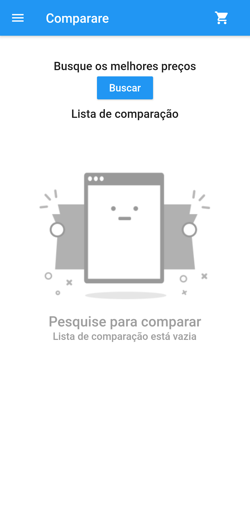
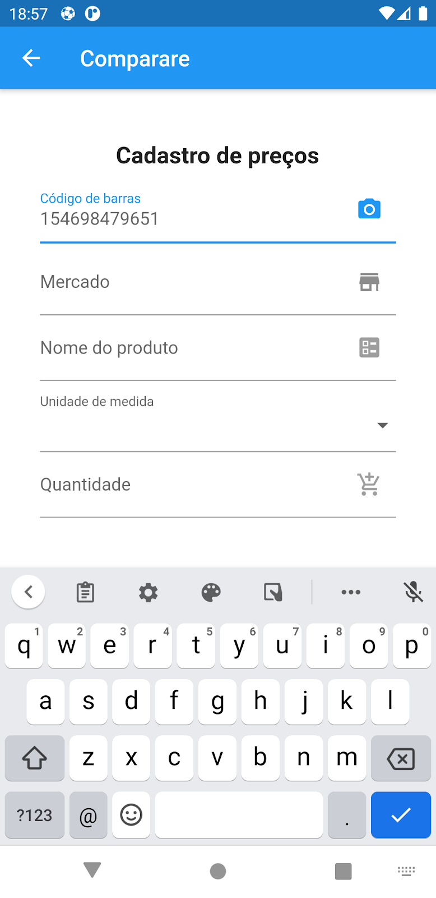
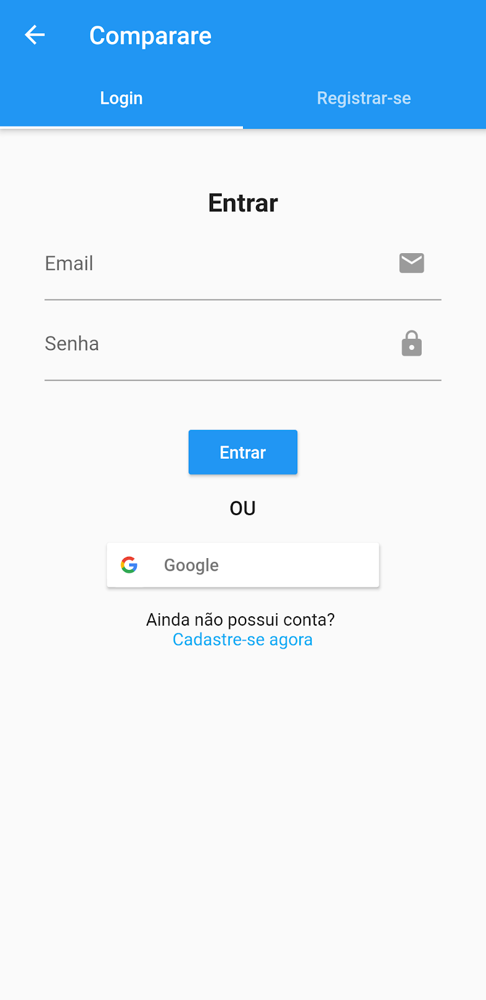
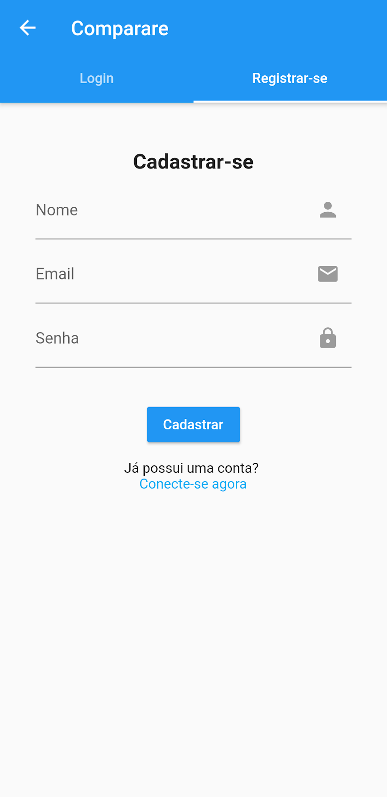

# Comparare

**[Baixe aqui](https://github.com/mukaschultze/comparare/releases/latest)**

Aplicativo para comparação de preços por escaneamento de código de barras desenvolvido usando [Flutter](https://flutter.dev/) e [Firebase](https://firebase.google.com/) para a discipila de Projeto de Software II da Universidade Federal de Santa Maria.

A listagem com todos os projetos da disciplina podem ser encontrados em [andreainfufsm.github.io/ps2-2020b/works](https://andreainfufsm.github.io/ps2-2020b/works)

## Building

- `flutter build apk --release`

OR

- `flutter build apk --target-platform android-arm,android-arm64,android-x64 --split-per-abi --release`

## Screenshots

|  |  |  |
| ------------------------------------------------ | --------------------------------------------------- | ---------------------------------------------------- |
|           |           |

## Desenvolvedores

| [ @mukaschultze](https://github.com/mukaschultze) | [ @gustavokessler](https://github.com/gustavokessler) |
| :-------------------------------------------------------------------------------------------------------------------------------: | --------------------------------------------------------------------------------------------------------------------------------------- |
